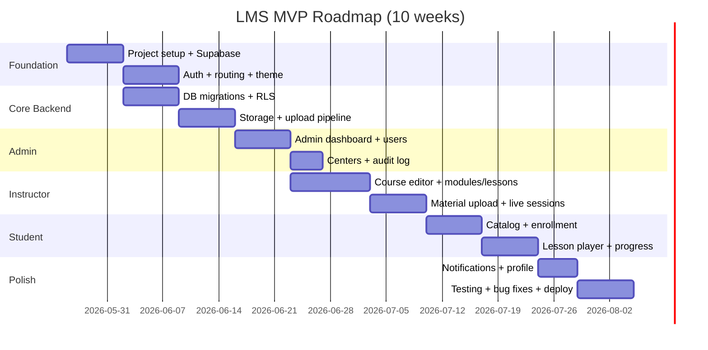

# MVP Roadmap — Timeline & Cost Estimate

**Version:** 1.0  
**Target MVP duration:** 8–10 weeks  
**Team assumption:** 1 full-stack Flutter developer + part-time designer/QA  
**Last updated:** 2026-05-23

---

## 1. MVP scope summary

### In scope
- Auth (email/password, role-based routing)
- Admin: user management, centers, dashboard stats
- Instructor: course/module/lesson CRUD, material upload, batch roster
- Student: catalog, enrollment, video/PDF viewer, progress tracking
- Platforms: Android, iOS, Web (Windows/macOS builds verified)
- Supabase backend with RLS
- In-app notifications (basic)

### Out of scope (Phase 2+)
- Payments, quizzes, assignments, push notifications
- Social login, phone OTP, certificates
- Offline video, AI features, parent portal

---

## 2. Phase breakdown

---

## 3. Week-by-week plan

### Week 1 — Foundation
| Task | Deliverable | Days |
|------|-------------|------|
| Flutter project scaffold | Repo, folder structure, packages | 1 |
| Supabase project setup | Project, auth, env config | 0.5 |
| DB migrations (core tables) | SQL in `supabase/migrations/` | 1.5 |
| Theme + shared widgets | Colors, typography, loading/error states | 1 |
| go_router skeleton | Routes for all roles (placeholder screens) | 1 |
| CI basic | `flutter analyze` + `flutter test` on push | 0.5 |

**Milestone:** App launches to login screen; Supabase connected

---

### Week 2 — Authentication
| Task | Deliverable | Days |
|------|-------------|------|
| Login screen | Email/password, validation, error handling | 1.5 |
| Register screen | Student registration + profile fields | 1.5 |
| Forgot password | Email reset flow | 0.5 |
| Auth provider + session | Riverpod auth state, token refresh | 1.5 |
| Role-based redirect | Admin/Instructor/Student home routing | 1 |
| RLS policies (profiles) | Security tested | 0.5 |

**Milestone:** Users can register, login, land on role-specific home

---

### Week 3 — Storage & data layer
| Task | Deliverable | Days |
|------|-------------|------|
| Storage buckets + policies | avatars, thumbnails, materials | 1 |
| Repository pattern setup | Base classes, error handling | 1 |
| Course/Module/Lesson repos | CRUD data layer | 2 |
| File upload service | file_picker → Supabase Storage | 1.5 |
| Signed URL edge function | Private video/doc access | 0.5 |

**Milestone:** Instructor can upload a file; metadata saved in DB

---

### Week 4 — Admin module
| Task | Deliverable | Days |
|------|-------------|------|
| Admin dashboard | Stats widgets (students, courses, enrollments) | 1.5 |
| Users list + search/filter | Paginated table/cards | 1.5 |
| Create/edit user | Admin invite flow | 1.5 |
| Centers CRUD | List + form | 1 |
| Responsive admin layout | Sidebar (desktop), drawer (mobile) | 0.5 |

**Milestone:** Admin manages users and centers

---

### Week 5 — Instructor course editor (part 1)
| Task | Deliverable | Days |
|------|-------------|------|
| Instructor dashboard | My courses, quick stats | 1 |
| Course list + create | Draft/publish flow | 1.5 |
| Module editor | Add/reorder/delete modules | 1.5 |
| Lesson editor | Add/reorder/delete lessons | 1.5 |
| Course thumbnail upload | Image to storage | 0.5 |

**Milestone:** Instructor builds full course structure (no media yet)

---

### Week 6 — Instructor content & batches
| Task | Deliverable | Days |
|------|-------------|------|
| Material upload UI | Video, PDF, audio, link per lesson | 2 |
| Batch create/manage | Schedule, assign students | 1.5 |
| Student roster view | Progress % per student | 1 |
| Live session scheduling | Create/list with meeting URL | 1 |
| Audit log (basic) | Admin view of key actions | 0.5 |

**Milestone:** Full course with video and documents publishable

---

### Week 7 — Student catalog & enrollment
| Task | Deliverable | Days |
|------|-------------|------|
| Course catalog | Filter by language/level, search | 1.5 |
| Course detail page | Syllabus, instructor, enroll CTA | 1 |
| Enrollment flow | Self-enroll + admin-assigned | 1 |
| Student dashboard | My courses, continue watching | 1.5 |
| RLS testing (enrollment) | Student cannot access non-enrolled content | 0.5 |

**Milestone:** Student enrolls and sees enrolled courses

---

### Week 8 — Lesson player & progress
| Task | Deliverable | Days |
|------|-------------|------|
| Video player | Chewie, resume position, speed control | 2 |
| PDF viewer | In-app document display | 1 |
| Progress tracking | Save position, auto-complete at 90% | 1.5 |
| Free preview lessons | Access without enrollment | 0.5 |
| Course progress UI | Progress bar on dashboard | 0.5 |

**Milestone:** End-to-end learning flow works

---

### Week 9 — Profile, notifications, polish
| Task | Deliverable | Days |
|------|-------------|------|
| Profile view/edit | Avatar upload, fields by role | 1.5 |
| In-app notifications | List, mark read | 1 |
| Empty/error states | All main screens | 1 |
| Cross-platform testing | Android, iOS, Web, Windows, macOS | 1.5 |
| Performance pass | Image caching, list pagination | 0.5 |

**Milestone:** Feature-complete MVP

---

### Week 10 — QA, deploy, launch
| Task | Deliverable | Days |
|------|-------------|------|
| Bug fixing | P0/P1 issues resolved | 2 |
| Integration tests | Auth, enrollment, progress flows | 1 |
| Web deploy | Supabase hosting or Vercel/Netlify | 0.5 |
| Mobile build | APK/TestFlight internal testing | 1 |
| Documentation | Admin user guide, deployment runbook | 0.5 |
| Launch buffer | Unexpected issues | 1 |

**Milestone:** MVP released to internal/beta users

---

## 4. Post-MVP roadmap (Phase 2 — weeks 11–16)

| Week | Feature |
|------|---------|
| 11–12 | Assignments + submissions + grading |
| 12–13 | Quizzes with auto-grading |
| 13–14 | Push notifications + email |
| 14–15 | Payments (Stripe/Paymob) + certificates |
| 15–16 | Google/Apple sign-in + Arabic RTL |

---

## 5. Cost estimate

### 5.1 Development cost (if outsourcing)

| Role | Rate (USD/hr) | Hours | Total |
|------|---------------|-------|-------|
| Flutter developer | $35–60 | 320–400 | $11,200–$24,000 |
| UI/UX designer | $30–50 | 40–60 | $1,200–$3,000 |
| QA tester | $25–40 | 40–60 | $1,000–$2,400 |
| **Total development** | | | **$13,400–$29,400** |

*Solo developer doing everything: ~350 hours ≈ $12,000–$21,000 at $35–60/hr*

### 5.2 Infrastructure cost (monthly)

#### MVP (up to ~200 students, ~50 GB video)

| Service | Plan | Cost/month |
|---------|------|------------|
| Supabase | Pro | $25 |
| Supabase Storage | ~50 GB included/overages | $0–5 |
| Bunny.net Stream (optional) | Pay-as-you-go | $10–30 |
| Domain | .com | $1 |
| Email (Resend/SendGrid) | Free tier | $0 |
| **Total MVP infra** | | **$36–61/month** |

#### Growth (500 students, 200 GB video, 2000 watch hrs/month)

| Service | Cost/month |
|---------|------------|
| Supabase Pro + compute | $25–75 |
| Bunny.net Stream | $30–60 |
| CDN/bandwidth | $10–20 |
| Firebase FCM | $0 |
| Sentry (errors) | $0–26 |
| **Total growth** | **$65–180/month** |

### 5.3 One-time costs

| Item | Cost |
|------|------|
| Apple Developer Program | $99/year |
| Google Play Console | $25 one-time |
| SSL/Domain | ~$15/year |
| App icons + splash design | $0–500 (if designer) |

### 5.4 Total first-year cost summary

| Scenario | Dev | Infra (12 mo) | Store fees | Total |
|----------|-----|---------------|------------|-------|
| **Solo dev (you build it)** | $0 | $432–732 | $124 | **$556–856** |
| **Freelancer MVP** | $13,400–$29,400 | $432–732 | $124 | **$13,956–$30,256** |
| **Agency MVP** | $40,000–$80,000 | $432–732 | $124 | **$40,556–$80,856** |

---

## 6. Team options

| Option | Pros | Cons | Cost |
|--------|------|------|------|
| **Solo (you)** | Lowest cost, full control | Slower, no design help | Time only |
| **Freelancer** | Fast MVP, experienced | Communication overhead | $13k–$30k |
| **Small agency** | Design + dev + QA | Expensive | $40k–$80k |
| **In-house hire** | Long-term maintenance | Salary + benefits | $3k–$8k/month |

**Recommendation:** Start solo or with one Flutter freelancer for MVP; hire/part-time QA in week 8.

---

## 7. Risk register

| Risk | Impact | Mitigation |
|------|--------|------------|
| Video storage costs spike | High | Compress to 720p; use Bunny.net; set upload limits |
| Web video CORS issues | Medium | Configure Supabase bucket CORS early (Week 3) |
| RLS policy bugs expose content | Critical | Security test week 7; peer review policies |
| Scope creep | High | Strict MVP list; Phase 2 backlog |
| Flutter web performance | Medium | Pagination, lazy loading, cached images |
| App Store rejection | Medium | Follow media/content guidelines; privacy policy |

---

## 8. Success metrics (MVP launch)

| Metric | Target |
|--------|--------|
| Registered users | 50+ beta users |
| Published courses | 3+ |
| Lesson completion rate | > 40% |
| Video playback errors | < 2% |
| App crash rate | < 1% sessions |
| Page load (web) | < 3s |

---

## 9. Launch checklist

- [ ] Privacy policy + terms of service published
- [ ] Supabase RLS audited
- [ ] Production env variables set
- [ ] Storage bucket policies verified
- [ ] Admin account created
- [ ] Backup strategy confirmed (Supabase daily)
- [ ] Error monitoring (Sentry) optional but recommended
- [ ] App store listings prepared (screenshots, description)
- [ ] Beta tester group enrolled (TestFlight + internal APK)

---

## 10. Document history

| Version | Date | Changes |
|---------|------|---------|
| 1.0 | 2026-05-23 | Initial MVP roadmap and cost estimate |
